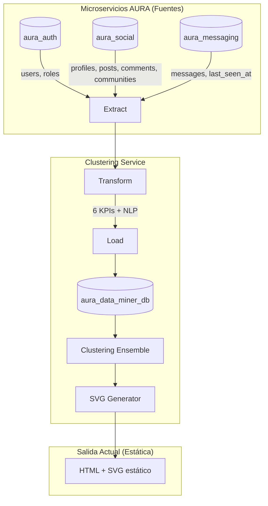
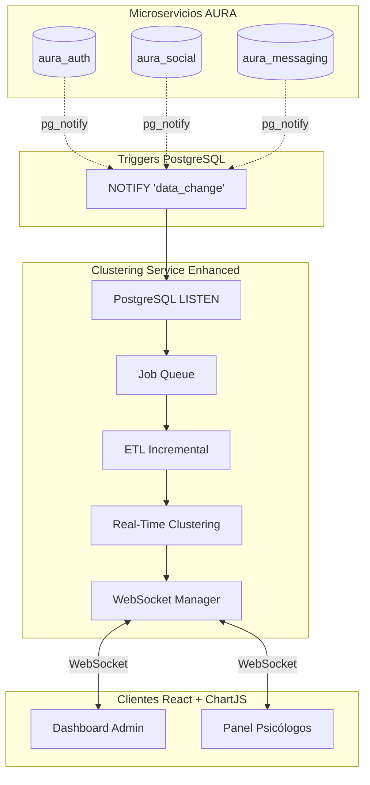
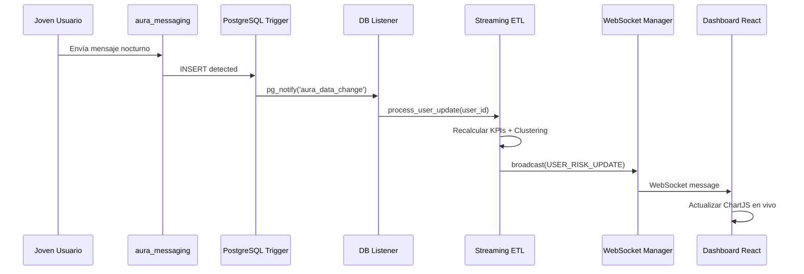

# 🔮 Plan de Mejoras: Clustering Service AURA - Gráficas en Tiempo Real

> **Fecha:** 2025-12-09  
> **Objetivo:** Transformar las visualizaciones estáticas en un sistema de gráficas en tiempo real usando WebSockets  
> **Contexto:** Detección de riesgos psicoemocionales en poblaciones juveniles

---

## 📖 Resumen del Análisis del Proyecto Actual

He analizado profundamente el proyecto **AURA Data Mining Service** y comprendido su arquitectura completa. A continuación presento un análisis técnico del funcionamiento y la propuesta de mejoras.

### 🏗️ Arquitectura Actual



### 📊 Los 6 KPIs Psicoemocionales

| KPI | Nombre | Indicador de Riesgo |
|:---:|:---|:---|
| 1 | **Reciprocity Ratio** | Aislamiento social (sigue a muchos sin ser seguido) |
| 2 | **Days Since Last Seen** | Abandono/retiro de la plataforma |
| 3 | **Night Messages Ratio** | Desorden circadiano (insomnio, ansiedad) |
| 4 | **Profile Incomplete** | Apatía, anhedonia |
| 5 | **Sentiment Negativity** | Depresión, crisis emocional (vía NLP) |
| 6 | **Community Categories** | Red de apoyo limitada |

### 🎯 Sistema de Votación para Detección de Riesgo

El sistema actual usa un **ensamble de 3 algoritmos** que votan:

1. **K-Means** → Identifica el cluster con peor perfil de KPIs
2. **DBSCAN** → Detecta outliers (usuarios aislados estadísticamente)
3. **Isolation Forest** → Detecta anomalías comportamentales

**Regla de decisión:**
- ≥2 votos → 🔴 **ALTO RIESGO**
- 1 voto → 🟡 **RIESGO MODERADO**
- 0 votos → 🟢 **BAJO RIESGO**

### ⚠️ Problema Actual: Gráficas Estáticas

Actualmente las visualizaciones en [visualizer.py](file:///home/luis/Documents/00INTEGRADOR/V5/data-mining/clustering-service-aura/app/clustering/visualizer.py):
- Se generan como **SVG estáticos** con Matplotlib
- Requieren **ejecución manual** del ETL y clustering
- No reflejan cambios en la base de datos principal
- No permiten monitoreo continuo de la población juvenil

---

## 🚀 Propuesta de Mejora: Sistema en Tiempo Real

### Arquitectura Propuesta



---

## 📋 Fases de Implementación

### Fase 1: Backend - WebSocket Server

#### 1.1 Agregar dependencias

```diff
# requirements.txt
+ websockets>=12.0
+ asyncpg>=0.29.0
+ python-socketio[asyncio]>=5.10.0
+ aiohttp>=3.9.0
```

#### 1.2 Crear WebSocket Manager

**[NEW] `app/realtime/websocket_manager.py`**

Gestiona las conexiones WebSocket activas y distribuye actualizaciones a los clientes conectados.

```python
# Estructura del módulo
class ConnectionManager:
    - active_connections: Dict[str, List[WebSocket]]
    
    async def connect(ws, channel) -> None
    async def disconnect(ws, channel) -> None
    async def broadcast(message, channel) -> None
```

#### 1.3 Listener PostgreSQL (CDC - Change Data Capture)

**[NEW] `app/realtime/db_listener.py`**

Escucha cambios en las tablas de los microservicios mediante `LISTEN/NOTIFY` de PostgreSQL.

```python
# Flujo
1. Crear triggers SQL en tablas críticas (posts, messages, users)
2. Los triggers ejecutan pg_notify('aura_data_change', payload)
3. El listener Python captura la notificación
4. Dispara el ETL incremental para el usuario afectado
```

**SQL Trigger de ejemplo:**
```sql
-- En aura_messaging.messages
CREATE OR REPLACE FUNCTION notify_message_change() RETURNS trigger AS $$
BEGIN
    PERFORM pg_notify('aura_data_change', json_build_object(
        'table', 'messages',
        'user_id', NEW.sender_profile_id,
        'timestamp', NOW()
    )::text);
    RETURN NEW;
END;
$$ LANGUAGE plpgsql;
```

---

### Fase 2: ETL Incremental en Tiempo Real

#### 2.1 Modificar el Extractor

**[MODIFY] [app/etl/extractor.py](file:///home/luis/Documents/00INTEGRADOR/V5/data-mining/clustering-service-aura/app/etl/extractor.py)**

Agregar método para extracción de un solo usuario:

```python
def extract_user_metrics(self, user_id: UUID) -> dict:
    """Extrae métricas de un usuario específico (incremental)."""
    # Similar a las queries actuales pero filtradas por user_id
```

#### 2.2 Pipeline Streaming

**[NEW] `app/realtime/streaming_pipeline.py`**

```python
class StreamingETLPipeline:
    async def process_user_update(self, user_id: UUID):
        # 1. Extracción incremental
        data = extractor.extract_user_metrics(user_id)
        # 2. Transformación (calcular KPIs)
        features = transformer.transform_single_user(data)
        # 3. Re-clustering (recalcular solo este usuario)
        risk_result = ensemble.predict_single(features)
        # 4. Notificar a clientes WebSocket
        await ws_manager.broadcast({
            'type': 'USER_RISK_UPDATE',
            'user_id': str(user_id),
            'risk_level': risk_result['risk_level'],
            'severity_index': risk_result['severity_index'],
            'timestamp': datetime.utcnow().isoformat()
        })
```

---

### Fase 3: API de Datos para React + ChartJS

#### 3.1 Nuevos Endpoints JSON

**[MODIFY] [app/api/clustering_routes.py](file:///home/luis/Documents/00INTEGRADOR/V5/data-mining/clustering-service-aura/app/api/clustering_routes.py)**

Agregar endpoints que retornen **JSON estructurado** en lugar de SVG:

```python
@router.get("/api/v2/clustering/data/distribution")
def get_distribution_data():
    """Retorna datos para gráfico de distribución (ChartJS compatible)."""
    return {
        "labels": ["BAJO RIESGO", "RIESGO MODERADO", "ALTO RIESGO"],
        "datasets": [{
            "data": [150, 45, 12],
            "backgroundColor": ["#10B981", "#F59E0B", "#EF4444"]
        }],
        "meta": {
            "total_users": 207,
            "high_risk_percentage": 5.8,
            "last_updated": "2025-12-09T14:30:00Z"
        }
    }

@router.get("/api/v2/clustering/data/scatter")
def get_scatter_data():
    """Retorna datos PCA para scatter plot (ChartJS compatible)."""
    return {
        "datasets": [
            {
                "label": "ALTO RIESGO",
                "data": [{"x": 0.5, "y": -1.2}, {"x": 0.8, "y": -0.9}],
                "backgroundColor": "#EF4444"
            },
            # ... más datasets por nivel de riesgo
        ]
    }

@router.get("/api/v2/clustering/data/kpi-trends")
def get_kpi_trends(hours: int = 24):
    """Retorna tendencias de KPIs en las últimas N horas."""
    # Para gráficos de línea temporal en ChartJS
```

#### 3.2 Endpoint WebSocket

```python
@router.websocket("/ws/clustering/live")
async def websocket_endpoint(websocket: WebSocket):
    """WebSocket para actualizaciones en tiempo real."""
    await manager.connect(websocket, channel="clustering")
    try:
        while True:
            # Los datos se envían cuando hay cambios en la DB
            await asyncio.sleep(0.1)
    except WebSocketDisconnect:
        manager.disconnect(websocket, channel="clustering")
```

---

### Fase 4: Mejora del Contexto Informativo

#### 4.1 Datos con Contexto Psicoemocional

Los datos deben incluir **interpretación clínica** para los usuarios finales (psicólogos, administradores):

```python
# Ejemplo de respuesta enriquecida
{
    "kpi": "sentiment_negativity_index",
    "value": 0.78,
    "interpretation": {
        "severity": "ALTA",
        "clinical_notes": [
            "El usuario muestra un patrón consistente de lenguaje negativo",
            "Detectadas 12 menciones de temas relacionados con aislamiento",
            "Incremento del 34% respecto a la semana anterior"
        ],
        "recommended_action": "Contacto prioritario por profesional de salud mental"
    }
}
```

#### 4.2 Alertas Contextuales

```python
class RiskAlertGenerator:
    def generate_alert(self, user_data: dict) -> dict:
        if user_data['risk_level'] == 'ALTO_RIESGO':
            return {
                "type": "CRITICAL_RISK_ALERT",
                "title": "⚠️ Usuario Requiere Atención Inmediata",
                "user_id": user_data['user_id'],
                "factors": [
                    "Inactividad prolongada (14 días)",
                    "Ratio de mensajes nocturnos anormal (67%)",
                    "Índice de negatividad NLP elevado (0.82)"
                ],
                "context": "Poblaciones juveniles con estos patrones tienen 3x mayor probabilidad de crisis emocional",
                "suggested_intervention": "Derivación a línea de apoyo emocional"
            }
```

---

## 🎨 Estructura de Mensajes WebSocket

### Tipos de Mensajes

| Tipo | Descripción | Frecuencia |
|:---|:---|:---|
| `INITIAL_STATE` | Estado completo al conectar | Una vez |
| `USER_RISK_UPDATE` | Cambio de riesgo de un usuario | Por evento |
| `DISTRIBUTION_UPDATE` | Cambio en la distribución general | Cada 30s |
| `CRITICAL_ALERT` | Alerta de usuario en alto riesgo | Inmediato |
| `KPI_TREND_UPDATE` | Actualización de tendencias | Cada 5min |

### Ejemplo de Mensaje WebSocket

```json
{
    "type": "USER_RISK_UPDATE",
    "timestamp": "2025-12-09T14:32:15.123Z",
    "payload": {
        "user_id": "550e8400-e29b-41d4-a716-446655440000",
        "previous_risk": "RIESGO_MODERADO",
        "current_risk": "ALTO_RIESGO",
        "severity_index": 78.5,
        "triggering_factors": [
            {"kpi": "days_since_last_seen", "delta": "+3 días"},
            {"kpi": "sentiment_negativity", "delta": "+0.15"}
        ]
    }
}
```

---

## 📁 Estructura de Archivos Propuesta

```
clustering-service-aura/
├── app/
│   ├── realtime/                    # [NEW] Módulo de tiempo real
│   │   ├── __init__.py
│   │   ├── websocket_manager.py     # Gestión de conexiones WS
│   │   ├── db_listener.py           # Listener PostgreSQL NOTIFY
│   │   ├── streaming_pipeline.py    # ETL incremental
│   │   └── alert_generator.py       # Generador de alertas clínicas
│   │
│   ├── api/
│   │   ├── clustering_routes.py     # [MODIFY] Agregar endpoints v2/JSON
│   │   └── websocket_routes.py      # [NEW] Endpoints WebSocket
│   │
│   ├── clustering/
│   │   ├── ensemble.py              # [MODIFY] Agregar predict_single()
│   │   └── visualizer.py            # Sin cambios (mantener para PDF reports)
│   │
│   └── main.py                       # [MODIFY] Iniciar WS server y listener
│
├── sql/
│   └── triggers/                     # [NEW] Scripts de triggers
│       └── notify_triggers.sql
```

---

## 📊 Resumen del Flujo en Tiempo Real



---

## ✅ Beneficios de la Implementación

1. **Detección Proactiva**: Identificar usuarios en riesgo *inmediatamente* cuando cambian sus patrones
2. **Intervención Temprana**: Los psicólogos pueden actuar antes de una crisis
3. **Monitoreo Continuo**: Dashboard siempre actualizado sin refrescar
4. **Escalabilidad**: Solo procesar usuarios que cambian (ETL incremental)
5. **Preparación para Cliente React**: API JSON lista para ChartJS

---

## 🔜 Próximos Pasos

Cuando estés listo para implementar, definiré en detalle:

1. Código completo del WebSocket Manager
2. Triggers SQL para cada tabla
3. Modificaciones al [main.py](file:///home/luis/Documents/00INTEGRADOR/V5/data-mining/clustering-service-aura/app/main.py) para inicializar los listeners
4. Endpoints JSON compatibles con ChartJS
5. Esquema de mensajes WebSocket documentado

¿Deseas que proceda con la implementación de alguna de estas fases?
