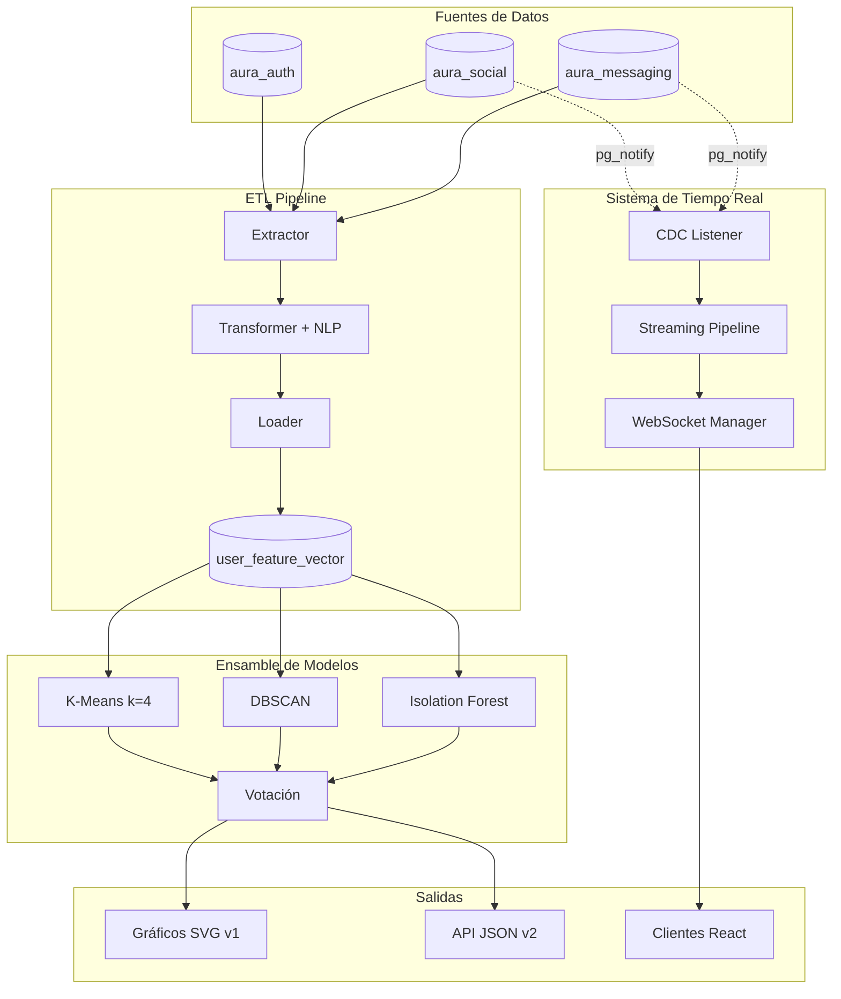
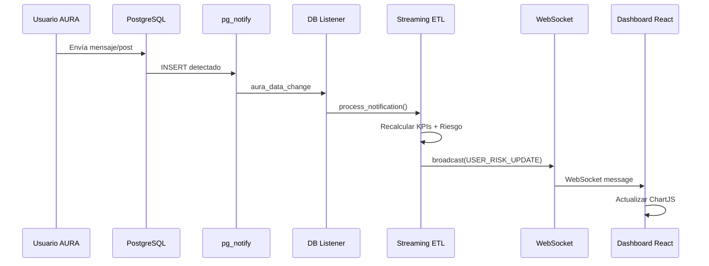

# 📊 Reporte de Arquitectura: Sistema de Clustering AURA

> **Fecha:** 2025-12-09  
> **Versión:** 2.0 (Tiempo Real)  
> **Referencia:** [Análisis de KPIs](./clustering-kpis-analysis.md), [Persistencia de Datos](./data-persistence.md)

---

Este documento detalla el diseño e implementación del sistema de clustering para identificar usuarios en riesgo de aislamiento social y problemas emocionales en la plataforma AURA, incluyendo las nuevas capacidades de tiempo real.

---

## 📑 Tabla de Contenidos

1. [Variables de Entrada (Feature Vector)](#1-variables-de-entrada-feature-vector)
2. [Métricas de Evaluación](#2-métricas-de-evaluación)
3. [Arquitectura del Sistema](#3-arquitectura-del-sistema)
4. [Diseño del Ensamble de Modelos](#4-diseño-del-ensamble-de-modelos)
5. [Índice de Severidad de Anomalía (ASI)](#5-índice-de-severidad-de-anomalía-asi)
6. [Sistema en Tiempo Real](#6-sistema-en-tiempo-real)
7. [Endpoints del API](#7-endpoints-del-api)
8. [Visualizaciones Generadas](#8-visualizaciones-generadas)
9. [Consideraciones de Implementación](#9-consideraciones-de-implementación)

---

## 1. Variables de Entrada (Feature Vector)

Las variables de entrada están basadas en los **6 KPIs** definidos para el contexto AURA:

| KPI | Variable | Fuente | Indicador de Riesgo |
|:---:|:---------|:-------|:--------------------|
| **1** | `reciprocity_ratio_norm` | `aura_social.user_profiles` | Aislamiento Social |
| **2** | `days_since_last_seen_norm` | `aura_messaging.users` | Retirada/Abandono |
| **3** | `ratio_night_messages` | `aura_messaging.messages` | Desorden Circadiano |
| **4** | `is_profile_incomplete` | `user_profiles`, `complete_profiles` | Apatía/Anhedonia |
| **5** | `sentiment_negativity_index` | Posts, Comments, Messages (NLP) | Crisis Emocional |
| **6** | `num_community_categories_norm` | `community_members` | Red de Apoyo limitada |

---

## 2. Métricas de Evaluación

### Priorización según el Problema

El objetivo es la **detección temprana de riesgos de salud mental**. La prioridad debe ser minimizar los **Falsos Negativos**.

| Métrica | Prioridad | Justificación |
|:--------|:---------:|:--------------|
| **Recall (Sensibilidad)** | 🔴 MÁXIMA | Preferible Falso Positivo que Falso Negativo |
| **Silhouette Score** | 🟡 ALTA | Objetivo: ≥ 0.3 |
| **Calinski-Harabasz** | 🟢 MEDIA | Compactación y separación de clusters |

---

## 3. Arquitectura del Sistema



---

## 4. Diseño del Ensamble de Modelos

### Enfoque: Voting Ensemble (3 Algoritmos)

| Algoritmo | Tipo | Criterio de Voto "RIESGO" |
|:----------|:-----|:--------------------------|
| **K-Means** | Centroides | Cluster con menor promedio de KPIs positivos |
| **DBSCAN** | Densidad | Usuario marcado como ruido (label = -1) |
| **Isolation Forest** | Aislamiento | Anomaly score < -0.5 |

### Regla de Decisión Final

```
≥2 votos → 🔴 ALTO RIESGO (Intervención prioritaria)
 1 voto  → 🟡 RIESGO MODERADO (Monitoreo)
 0 votos → 🟢 BAJO RIESGO (Normal)
```

---

## 5. Índice de Severidad de Anomalía (ASI)

Para priorizar la intervención, se calcula un índice numérico continuo (0-100):

$$
ASI = 0.5 \cdot (1 - S_{iso}) + 0.3 \cdot I_{dbscan} + 0.2 \cdot D_{kmeans}
$$

| Componente | Peso | Descripción |
|:-----------|:----:|:------------|
| $S_{iso}$ | 0.5 | Score Isolation Forest (1 = muy normal) |
| $I_{dbscan}$ | 0.3 | Binario (1 si outlier DBSCAN) |
| $D_{kmeans}$ | 0.2 | Distancia al centroide de riesgo |

---

## 6. Sistema en Tiempo Real

### 6.1 Arquitectura CDC (Change Data Capture)



### 6.2 Triggers SQL

Los triggers PostgreSQL notifican cambios en tablas críticas:

| Base de Datos | Tablas Monitoreadas |
|:--------------|:--------------------|
| `aura_messaging` | `messages`, `users` |
| `aura_social` | `posts`, `comments`, `user_profiles`, `community_members` |

### 6.3 Tipos de Mensajes WebSocket

| Tipo | Descripción | Canal |
|:-----|:------------|:------|
| `INITIAL_STATE` | Estado al conectar | clustering |
| `USER_RISK_UPDATE` | Cambio de riesgo | clustering |
| `CRITICAL_ALERT` | Usuario → Alto Riesgo | alerts |
| `DISTRIBUTION_UPDATE` | Cambio en distribución | clustering |

---

## 7. Endpoints del API

### API v1 - SVG Estático

| Método | Endpoint | Descripción |
|:-------|:---------|:------------|
| `POST` | `/api/v1/clustering/execute` | Ejecutar clustering |
| `GET` | `/api/v1/clustering/results` | Resultados del clustering |
| `GET` | `/api/v1/clustering/visualize/dashboard` | Dashboard completo SVG |
| `GET` | `/api/v1/clustering/visualize/scatter` | Scatter PCA |
| `GET` | `/api/v1/clustering/visualize/distribution` | Distribución de riesgo |
| `GET` | `/api/v1/clustering/visualize/radar` | Radar de KPIs |
| `GET` | `/api/v1/clustering/users/{risk_level}` | Usuarios por riesgo |

### API v2 - Tiempo Real + ChartJS

| Tipo | Endpoint | Descripción |
|:-----|:---------|:------------|
| WebSocket | `/api/v2/clustering/ws/live` | Actualizaciones en vivo |
| WebSocket | `/api/v2/clustering/ws/alerts` | Alertas críticas |
| GET | `/api/v2/clustering/data/distribution` | JSON para Bar/Pie chart |
| GET | `/api/v2/clustering/data/scatter` | JSON para Scatter plot |
| GET | `/api/v2/clustering/data/radar` | JSON para Radar chart |
| GET | `/api/v2/clustering/data/severity-histogram` | JSON para Histogram |
| GET | `/api/v2/clustering/data/kpi-trends?hours=24` | JSON para Line chart |
| GET | `/api/v2/clustering/data/high-risk-users` | Usuarios prioritarios |
| GET | `/api/v2/clustering/status` | Estado del sistema |

---

## 8. Visualizaciones Generadas

### 8.1 Scatter Plot PCA
Proyección 2D de usuarios coloreados por nivel de riesgo.

### 8.2 Distribución de Riesgo
Gráfico de barras con conteo por categoría.

### 8.3 Radar Chart de KPIs
Perfil promedio de cada cluster para diagnóstico diferencial.

### 8.4 Histograma de Severidad
Distribución del ASI para priorizar intervención.

### 8.5 Tendencias Temporales (v2)
Gráfico de líneas mostrando evolución de KPIs en el tiempo.

---

## 9. Consideraciones de Implementación

| Aspecto | Implementación |
|:--------|:---------------|
| **Normalización** | MinMaxScaler [0, 1] para todos los KPIs |
| **Valor Cero** | Significativo (0 comunidades = aislamiento real) |
| **Calibración** | Ajustar umbrales con feedback de psicólogos |
| **Interpretabilidad** | Sistema de votación explica clasificaciones |
| **Escalabilidad** | ETL incremental procesa solo usuarios que cambian |
| **Alertas** | WebSocket para notificación inmediata de casos críticos |

---

*Documento actualizado para AURA Clustering Service v2.0 - Sistema de Detección en Tiempo Real*
