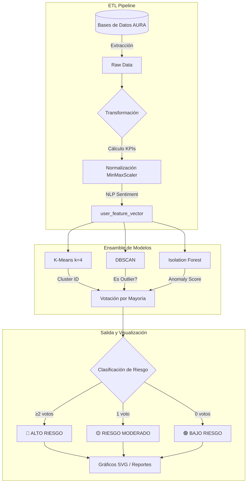

# Reporte de Actividad: Sistema de Clustering para Detección de Riesgos en AURA

> **Fecha:** 2025-12-05  
> **Referencia:** [Análisis de KPIs](./clustering-kpis-analysis.md), [Persistencia de Datos](./data-persistence.md)  
> **Contexto:** Implementación del sistema de detección de riesgos mediante clustering no supervisado

---

Este documento detalla el diseño e implementación de un sistema de clustering para identificar usuarios en riesgo de aislamiento social y problemas emocionales en la plataforma AURA.

---

## 1. Variables de Entrada (Feature Vector)

Las variables de entrada para el modelo de clustering están basadas en los **6 KPIs** definidos para el contexto AURA. Estos KPIs cubren las dimensiones de actividad social, conexión emocional y patrones de comportamiento.

| KPI | Variable | Fuente | Justificación |
| :---: | :--- | :--- | :--- |
| **1** | `reciprocity_ratio_norm` | `aura_social.user_profiles` | **Aislamiento Social.** Ratio normalizado entre seguidores/seguidos. Un desbalance indica búsqueda de validación sin reciprocidad o retiro social pasivo. |
| **2** | `days_since_last_seen_norm` | `aura_messaging.users` | **Retirada.** Días desde la última actividad. Un aumento progresivo correlaciona con episodios depresivos o abandono de la plataforma. |
| **3** | `ratio_night_messages` | `aura_messaging.messages` | **Desorden Circadiano.** Porcentaje de mensajes enviados entre 1:00-5:00 AM. Proxy de insomnio asociado con ansiedad/depresión. |
| **4** | `is_profile_incomplete` | `aura_social.user_profiles`, `complete_profiles` | **Apatía/Anhedonia.** Perfil incompleto indica falta de inversión en identidad digital. |
| **5** | `sentiment_negativity_index` | Posts, Comments, Messages (NLP) | **Estado Emocional.** Índice de negatividad detectado por modelos Transformer (RoBERTa). |
| **6** | `num_community_categories_norm` | `aura_social.community_members` | **Red de Apoyo.** Densidad de participación en categorías diversas de comunidades. |

---

## 2. Métricas de Evaluación

### Priorización según el Problema

Dado que el objetivo es la **detección temprana de riesgos de salud mental**, la prioridad debe ser minimizar los **Falsos Negativos** (no detectar a alguien en riesgo).

| Métrica | Prioridad | Justificación |
| :--- | :---: | :--- |
| **Recall (Sensibilidad)** | 🔴 MÁXIMA | Preferible un Falso Positivo (revisión adicional) que un Falso Negativo (crisis no detectada). |
| **Silhouette Score** | 🟡 ALTA | Evalúa la calidad de separación de clusters. Objetivo: ≥ 0.3 |
| **Calinski-Harabasz Index** | 🟢 MEDIA | Indica qué tan compactos y separados están los clusters. |

### Método de Correlación Recomendado

**Mutual Information (Información Mutua)**: El comportamiento humano rara vez es lineal. La cantidad de amigos cercanos a 0 es malo, pero tener miles tampoco garantiza salud mental. MI detecta dependencias no lineales.

---

## 3. Arquitectura del Sistema de Clustering



---

## 4. Diseño del Ensamble de Modelos

### Enfoque: Voting Ensemble (3 Algoritmos)

Se utilizan tres algoritmos complementarios que votan independientemente sobre el riesgo de cada usuario:

| Algoritmo | Tipo | Criterio de Voto "RIESGO" |
| :--- | :--- | :--- |
| **K-Means** | Basado en Centroides | Usuario pertenece al cluster con menor promedio de KPIs positivos |
| **DBSCAN** | Basado en Densidad | Usuario marcado como ruido (label = -1) |
| **Isolation Forest** | Basado en Aislamiento | Anomaly score < -0.5 (configurable) |

### Regla de Decisión Final

```
Si votos >= 2: ALTO RIESGO (Intervención prioritaria)
Si votos == 1: RIESGO MODERADO (Monitoreo)
Si votos == 0: BAJO RIESGO (Normal)
```

---

## 5. Índice de Severidad de Anomalía (ASI)

Para priorizar la intervención, se calcula un índice numérico continuo (0-100):

$$
ASI = w_1 \cdot (1 - S_{iso}) + w_2 \cdot I_{dbscan} + w_3 \cdot D_{kmeans}
$$

| Componente | Peso | Descripción |
| :--- | :---: | :--- |
| $S_{iso}$ | 0.5 | Score normalizado de Isolation Forest (1 = muy normal) |
| $I_{dbscan}$ | 0.3 | Variable binaria (1 si es outlier DBSCAN) |
| $D_{kmeans}$ | 0.2 | Distancia al centroide del cluster de riesgo |

---

## 6. Endpoints del API

El servicio expone los siguientes endpoints para ejecutar el clustering y visualizar resultados:

| Método | Endpoint | Descripción |
| :--- | :--- | :--- |
| `POST` | `/api/v1/clustering/execute` | Ejecuta el ensamble de clustering sobre los datos ETL |
| `GET` | `/api/v1/clustering/results` | Obtiene los resultados del último clustering |
| `GET` | `/api/v1/clustering/visualize/scatter` | Gráfico de dispersión 2D (PCA) en SVG |
| `GET` | `/api/v1/clustering/visualize/distribution` | Distribución de clusters en SVG |
| `GET` | `/api/v1/clustering/visualize/radar` | Radar chart de KPIs por cluster en SVG |
| `GET` | `/api/v1/clustering/users/{risk_level}` | Lista usuarios por nivel de riesgo |

---

## 7. Visualizaciones Generadas

### 7.1 Scatter Plot (PCA 2D)
Proyección de usuarios en 2 dimensiones usando PCA. Coloreados por nivel de riesgo.

### 7.2 Distribución de Clusters
Gráfico de barras mostrando la cantidad de usuarios por categoría de riesgo.

### 7.3 Radar Chart por Cluster
Perfil promedio de KPIs para cada cluster, permitiendo identificar patrones característicos.

### 7.4 Heatmap de Correlación
Matriz de correlación entre los 6 KPIs para entender interdependencias.

---

## 8. Consideraciones de Implementación

1. **Normalización Robusta**: Los KPIs tienen escalas diferentes. Se usa `MinMaxScaler` para normalizar a [0, 1].

2. **Manejo del "Cero"**: En contexto AURA, el 0 (0 comunidades, 0 mensajes) es un valor significativo, no un dato faltante.

3. **Calibración Continua**: Los umbrales de riesgo deben ajustarse con feedback del equipo de psicólogos.

4. **Interpretabilidad**: El sistema de votación permite explicar por qué un usuario fue clasificado como riesgo.

---

*Documento generado para el proyecto AURA - Sistema de Clustering para Detección de Riesgos*
